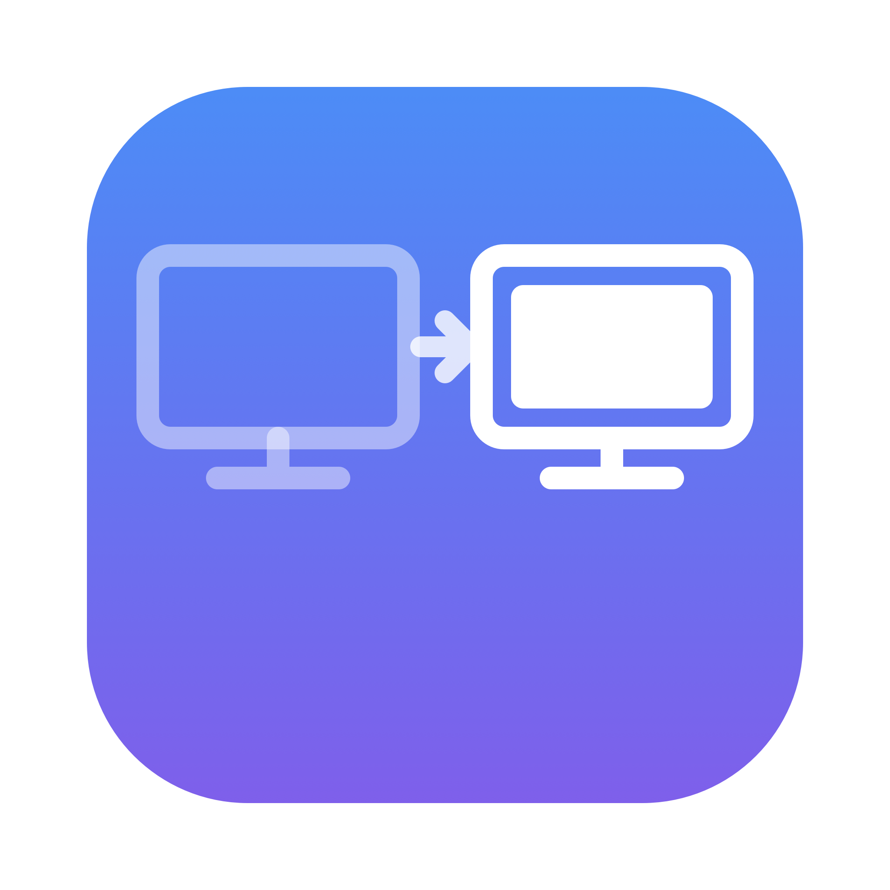

<p align="center">
  <picture>
    <source media="(prefers-color-scheme: dark)" srcset="docs/logo-dark.png">
    
  </picture>
</p>

<h1 align="center">ScreenRules</h1>

<p align="center">macOS 菜单栏小工具：让每个 App 的窗口<b>在你指定的屏幕</b>、以<b>你指定的大小</b>打开。</p>

## 为什么做这个

macOS 几乎把所有新窗口都开在**主屏**。双屏用户只能不停拖窗口。系统自带的 Dock「分配给显示器 N 的桌面」和 Spaces 深度绑定，行为经常不一致。

ScreenRules 用按 App 的规则解决：

- **屏幕规则** —— App 的新窗口自动开在主屏或副屏
- **尺寸规则** —— 可选把窗口调整为目标屏的 50%～100%，居中放置
- **强制模式对付倔强 App** —— 有些 App（比如点 Dock 时自己把窗口放回主屏的）会被多轮纠正：激活后 0.3s / 1.2s / 3s 各盘点一次
- 对话框、抽屉、浮动面板只搬屏，绝不强行缩放

## 安装运行

需要 macOS 13+ 和 Swift 工具链（装 Xcode Command Line Tools 即可，项目不依赖 Xcode 工程）。

```sh
git clone https://github.com/cc-hearts/screen-rules.git
cd screen-rules
./run.sh        # 构建 + （重）启动
```

首次启动按提示授予**辅助功能权限**（系统设置 → 隐私与安全性 → 辅助功能）。App 每 1.5 秒自动检测授权状态，无需重启。

## 使用

1. 把要设置的 App 切到前台
2. 点菜单栏的 ScreenRules 图标 →「当前 App：xxx」
3. 选「屏幕」和/或「窗口大小」
4. 规则立即对已打开的窗口生效，之后每个新窗口都遵守

其他菜单项：

- **立即按规则整理所有窗口** —— 一键把所有有规则的 App 的窗口归位
- **打开规则文件…** —— 规则存放在 `~/Library/Application Support/ScreenRules/rules.json`
- **打开调试日志…** —— 每个监听到的事件和搬移结果都记录在 `debug.log`

## 原理

- 通过 `AXObserver` 监听所有常规 App 的 `kAXWindowCreatedNotification`，配合 `NSWorkspace` 的启动 / 激活 / 退出通知
- 窗口创建后 0.25s / 1s 两轮执行规则（很多 App 建完窗口还会自己挪一次，第二轮保证赢）
- App 激活后（覆盖「点 Dock 不产生新窗口」的场景）0.3s / 1.2s / 3s 三轮强制盘点
- 搬屏保持窗口尺寸、按相对位置映射；尺寸规则按目标屏可见区域缩放并居中
- 屏幕按**主/副语义**匹配而非硬件 ID —— 重新插拔、换线都不会让规则失效
- 用固定自签名证书签名（`.signing/`，不进 git），重新构建后授权不丢失

纯 SwiftPM / AppKit，约 500 行，零依赖。

## 已知限制

- 无法操作以其他用户/权限运行的 App 的窗口
- 全屏窗口按设计不处理
- 极少数 App 的非标准窗口拒绝被移动，遇到请看调试日志

## 许可证

[MIT](LICENSE)
